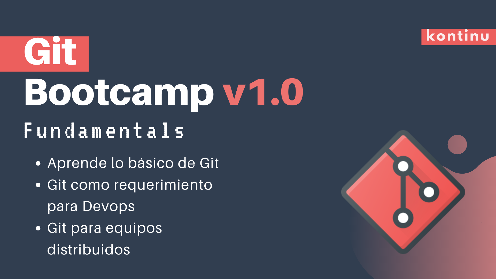

# Bievenidos



---

# Local 
## HELP

```
git help


git <command> --help
```

## git init

```bash
git init
```

## git status

```
git status
```


## git add

```
git add <files to add>
```

## git commit
```
git commit -m "message"
```

## git log

```
git log
```


---
# Github

---
# Remotes

## git remote add

## git remote -v

## git push


---
# Branches


---
# merge/ pull requests